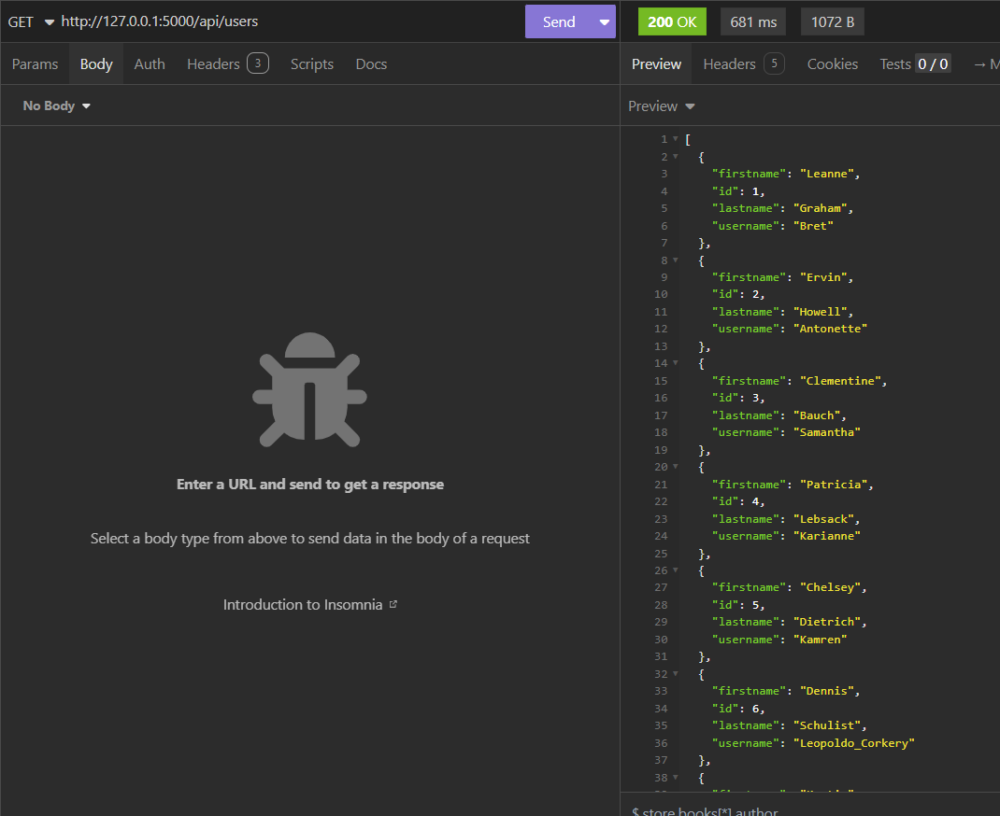
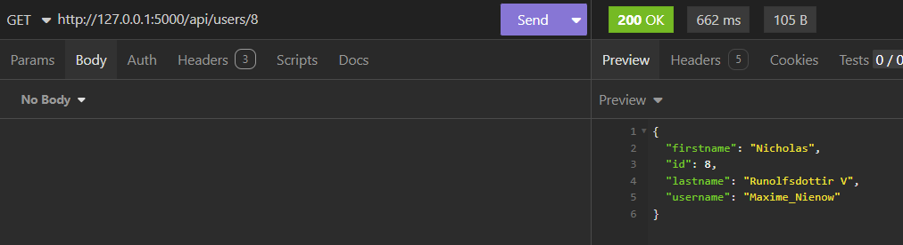
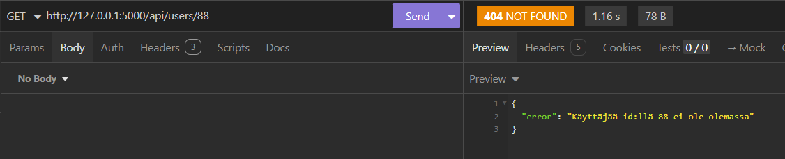
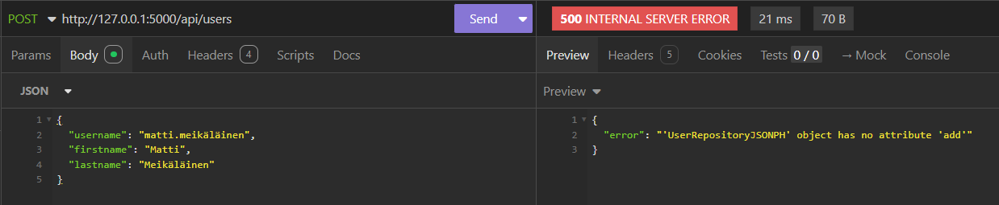

# Tehtävä 3 

## Kuvaus
Ohjelman avulla on mahdollista hakea osoitteessa https://jsonplaceholder.typicode.com/users/ listattujen kaikkien käyttäjien tai yksittäisen käyttäjän id-, etunimi-, sukunimi- ja käyttäjänimitiedot. Lisäksi ohjelmaa on mahdollista käyttää PostgreSQL- tai MySQL-tietokantojen kanssa, jolloin ohjelman avulla pystytään suorittamaan käyttäjien tai yksittäisen käyttäjän tietokannasta hakemisen lisäksi myös käyttäjän lisääminen, käyttäjätietojen päivittäminen ja käyttäjän poistaminen.

## Projektin konfigurointi Windows-käyttöjärjestelmällä
1. Kloonaa repositorio:
```
git clone https://peke.plab.fi/ilaurant/exercise3.git
```
2. Avaa projekti esim. *Visual Studio Codella*:
```
code exercise3
```
3. Luo vasemmassa laidassa näkyvän projektikansion tiedostopuun juureen *.env*-tiedosto. 
- Kun tarkoituksena on hakea käyttäjät tai yksittäinen verkon yli, lisää tiedostoon alla oleva muuttujan määrittely:
```
DB=internet
```
- Jos haluat käyttää ohjelmaa tietokantapohjaisesti ja kokeilla kaikkia CRUD-operaatioita, seuraa tähän liittyviä [ohjeita](./usage_with_database.md).

3. Avaa terminaali, navigoi projektin juureen ja luo virtuaaliympäristö:
```
python -m venv venv
```
4. Käynnistä virtuaaliympäristö:
```
venv\Scripts\activate
```
5. Asenna riippuvuudet:
```
python -m pip install -r requirements.txt
```
6. Käynnistä sovellus:
```
python app.py
```

## Käyttäjien hakeminen

GET-pyynnöt lähetetään seuraaviin endpointeihin:
- http://127.0.0.1:5000/api/users
- http://127.0.0.1:5000/api/users/{id} *

*={id}:n tilalle syötetään valittu tunnus

### Esimerkkejä

Esimerkeissä *.env*-tiedoston *DB*-muuttujan arvona on *internet*, jolloin tiedot haetaan verkon yli eikä RUD-operaatioiden tekeminen ole mahdollista.

Kaikkien käyttäjien hakeminen:



Yksittäisen käyttäjän hakeminen:



Käyttäjän hakeminen id:llä, jota ei ole olemassa:



Käyttäjän lisääminen (koska *.env*-tiedoston *DB*-muuttujan arvona on *internet*):




