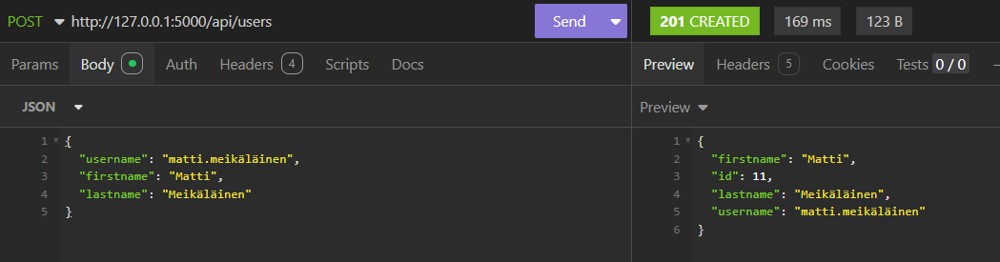
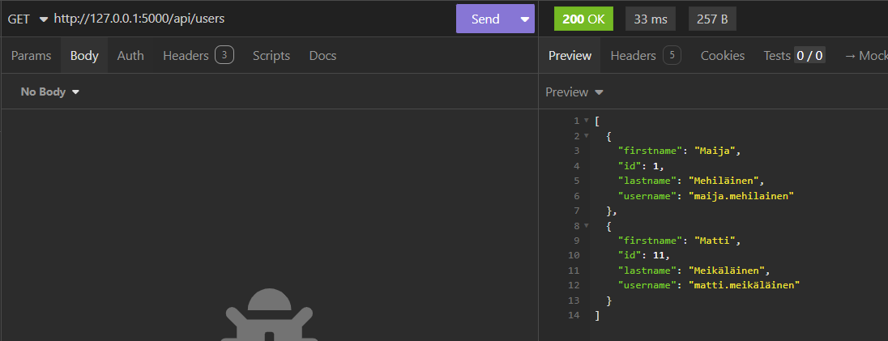
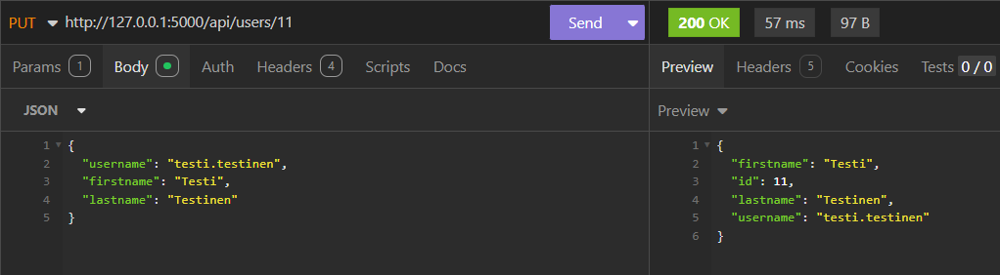
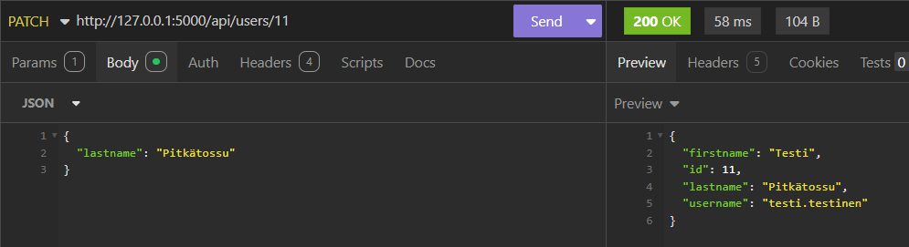
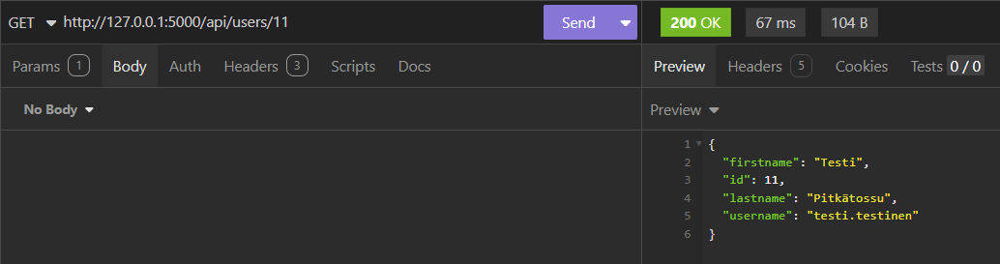
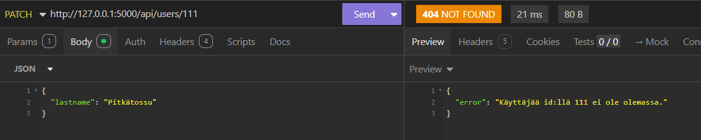
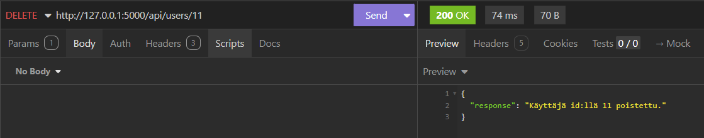

## Ohjelman käyttö tietokantojen kanssa 

Ohjelman kautta on mahdollista suorittaa CRUD-tietokantaoperaatioita. Sitä varten tarvitaan *sovelluskehykset_bad1*-niminen *MySQL*- tai *PostgreSQL*-tietokanta tai molemmat, joissa on *users*-taulu. Taulussa on oltava sarakkeet *id* (PK, AI, NN, int), *username* (NN, varchar255), *firstname* (NN, varchar255) ja *lastname* (NN, varchar255).

Luo vasemmassa laidassa näkyvän projektikansion tiedostopuun juureen *.env*-tiedosto, jos sitä ei vielä ole.  

- Jos käytät ohjelmaa *PostgreSQL*-tietokannan kanssa, lisää tiedostoon alla olevat muuttujat. Jos muuttujassa on hakasulut, täytä niiden tilalle tietokantakohtaiset arvot:
```
DB=postgres
DB_NAME=sovelluskehykset_bad1
POSTGRES_USER=[kirjoita tähän PostgreSQL-tietokannan käyttäjä]
POSTGRES_HOST=localhost
POSTGRES_PW=[kirjoita tähän PostgreSQL-tietokannan salasana, jos sellainen on. Muussa tapauksessa kirjoita: ""]
```
- Jos käytät ohjelmaa *MySQL*-tietokannan kanssa, lisää tiedostoon seuraavat muuttujat:
```
DB=mysql
DB_NAME=sovelluskehykset_bad1
MYSQL_USER=[kirjoita tähän MySQL-tietokannan käyttäjä]
MYSQL_PW=[kirjoita tähän MySQL-tietokannan salasana, jos sellainen on. Muussa tapauksessa kirjoita: ""]
```
- Jos tietokannasta löytyy versio kummallakin tietokantaohjelmistolla, voi yllä olevat muuttujat lisätä samaan *.env*-tiedostoon. Poista silloin **toinen** *DB*-muuttuja. Jäljelle jäävän *DB*-muuttujan tilalle voi kirjoittaa sen tietokantaohjelmiston nimen, jota kulloinkin on tarkoitus käyttää. Poista tässä tapauksessa myös **toinen** *DB_NAME*-muuttuja.
- Tallenna muutokset ja käynnistä tietokantaohjelmisto.
- Toteuta projektin muut konfiguraatiovaiheet vaiheet [ohjeen](./README.md) mukaan.

## CRUD-tietokantaoperaatioiden testaaminen

GET-pyynnöt lähetetään seuraaviin endpointeihin:
- http://127.0.0.1:5000/api/users
- http://127.0.0.1:5000/api/users/{id} *

POST-pyyntö lähetetään seuraavaan endpointiin:
- http://127.0.0.1:5000/api/users

PUT-, PATCH- ja DELETE-pyynnöt lähetetään seuraavaan endpointiin:
- http://127.0.0.1:5000/api/users/{id} *

*={id}:n tilalle syötetään valittu tunnus

POST- ja PUT-pyyntöihin on liitettävä *JSON*-objektimuotoinen body, josta löytyvät avaimet "username", "firstname" ja "lastname" valittuine arvoineen. 

PATCH-pyyntöihin on liitettävä *JSON*-objektimuotoinen body, jossa on avain "lastname" valitulla arvolla.

### Esimerkkejä

Esimerkeissä käytetään *MySQL*-tietokantaa

Käyttäjän lisääminen:



Käyttäjien hakeminen:



Käyttäjän kaikkien tietojen muokkaaminen:



Käyttäjän sukunimitiedon muokkaaminen:



Käyttäjän hakeminen id:n perusteella:



Sukunimitiedon muokkaaminen id:llä, jolla käyttäjää ei ole olemassa:



Käyttäjän poistaminen:

